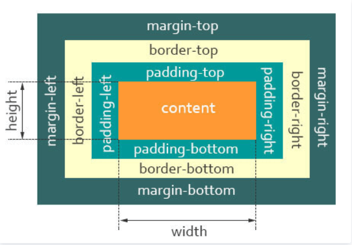
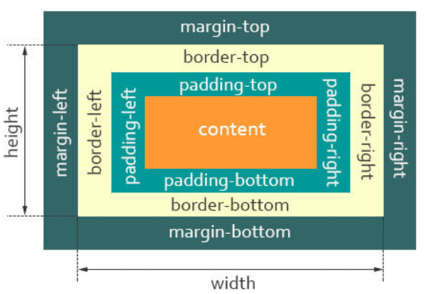

# CSS 知识点

## 说说你对盒子模型的理解

- 标准盒子模型

  

  - 盒子总宽度 = width + padding + border + margin;
  - 盒子总高度 = height + padding + border + margin

也就是，`width/height` 只是内容高度，不包含 `padding` 和 `border `值

- 怪异盒子模型

  

  - 盒子总宽度 = width + margin;

  - 盒子总高度 = height + margin;

也就是，`width/height` 包含了 `padding `和 `border `值

## 什么是 BFC

先看下 MDN 上关于 BFC 的定义：

> 块格式化上下文（`Block Formatting Context`，`BFC`） 是 Web 页面的可视 CSS 渲染的一部分，是块盒子的布局过程发生的区域，也是浮动元素与其他元素交互的区域。

具有 `BFC` 特性的元素可以看作是隔离了的独立容器，容器里面的元素不会在布局上影响到外面的元素，并且 `BFC` 具有普通容器所没有的一些特性。

## css 选择器有哪些？优先级分别是什么？哪些属性可以继承？

关于`css`属性选择器常用的有：

:::tip

1. id 选择器（#box），选择 id 为 box 的元素
2. 类选择器（.one），选择类名为 one 的所有元素
3. 标签选择器（div），选择标签为 div 的所有元素
4. 后代选择器（#box div），选择 id 为 box 元素内部所有的 div 元素
5. 子选择器（.one>one_1），选择父元素为.one 的所有.one_1 的元素
6. 相邻同胞选择器（.one+.two），选择紧接在.one 之后的所有.two 元素
7. 群组选择器（div,p），选择 div、p 的所有元素
   :::

相信大家对`CSS`选择器的优先级都不陌生：

> 内联 > ID 选择器 > 类选择器 > 标签选择器

在`css`中，继承是指的是给父元素设置一些属性，后代元素会自动拥有这些属性 关于继承属性，可以分成：

:::tip 字体系列属性

- font:组合字体
- font-family:规定元素的字体系列
- font-weight:设置字体的粗细
- font-size:设置字体的尺寸
- font-style:定义字体的风格
- font-variant:偏大或偏小的字体
  :::

:::tip 文本系列属性

- text-indent：文本缩进
- text-align：文本水平对齐
- line-height：行高
- word-spacing：增加或减少单词间的空白
- letter-spacing：增加或减少字符间的空白
- text-transform：控制文本大小写
- direction：规定文本的书写方向
- color：文本颜色
  :::

:::tip 元素可见性

visibility
:::

:::tip 表格布局属性

- caption-side：定位表格标题位置
- border-collapse：合并表格边框
- border-spacing：设置相邻单元格的边框间的距离
- empty-cells：单元格的边框的出现与消失
- table-layout：表格的宽度由什么决定
  :::

:::tip 列表属性

- list-style-type：文字前面的小点点样式
- list-style-position：小点点位置
- list-style：以上的属性可通过这属性集合
  :::

:::tip 引用

quotes：设置嵌套引用的引号类型
:::

:::tip 光标属性

cursor：箭头可以变成需要的形状
:::

:::warning 继承中比较特殊的几点：

- a 标签的字体颜色不能被继承
- h1-h6 标签字体的大下也是不能被继承的
  :::
