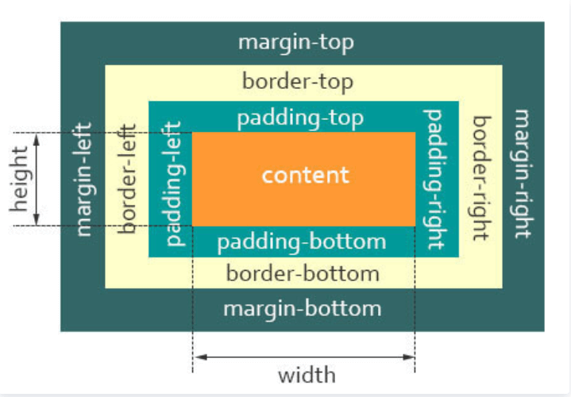
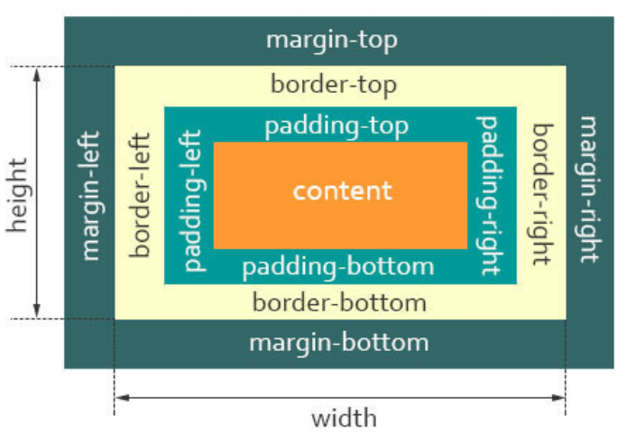

# CSS 知识点

## 说说你对盒子模型的理解

- 标准盒子模型

  

  - 盒子总宽度 = width + padding + border + margin;
  - 盒子总高度 = height + padding + border + margin

也就是，`width/height` 只是内容高度，不包含 `padding` 和 `border `值

- 怪异盒子模型

  

  - 盒子总宽度 = width + margin;

  - 盒子总高度 = height + margin;

也就是，`width/height` 包含了 `padding `和 `border `值

## 什么是 BFC

先看下 MDN 上关于 BFC 的定义：

> 块格式化上下文（`Block Formatting Context`，`BFC`） 是 Web 页面的可视 CSS 渲染的一部分，是块盒子的布局过程发生的区域，也是浮动元素与其他元素交互的区域。

具有 `BFC` 特性的元素可以看作是隔离了的独立容器，容器里面的元素不会在布局上影响到外面的元素，并且 `BFC` 具有普通容器所没有的一些特性。

## css 选择器有哪些？优先级分别是什么？哪些属性可以继承？

关于`css`属性选择器常用的有：

:::tip

1. id 选择器（#box），选择 id 为 box 的元素
2. 类选择器（.one），选择类名为 one 的所有元素
3. 标签选择器（div），选择标签为 div 的所有元素
4. 后代选择器（#box div），选择 id 为 box 元素内部所有的 div 元素
5. 子选择器（.one>one_1），选择父元素为.one 的所有.one_1 的元素
6. 相邻同胞选择器（.one+.two），选择紧接在.one 之后的所有.two 元素
7. 群组选择器（div,p），选择 div、p 的所有元素
   :::

相信大家对`CSS`选择器的优先级都不陌生：

> 内联 > ID 选择器 > 类选择器 > 标签选择器

在`css`中，继承是指的是给父元素设置一些属性，后代元素会自动拥有这些属性 关于继承属性，可以分成：

:::tip 字体系列属性

- font:组合字体
- font-family:规定元素的字体系列
- font-weight:设置字体的粗细
- font-size:设置字体的尺寸
- font-style:定义字体的风格
- font-variant:偏大或偏小的字体
  :::

:::tip 文本系列属性

- text-indent：文本缩进
- text-align：文本水平对齐
- line-height：行高
- word-spacing：增加或减少单词间的空白
- letter-spacing：增加或减少字符间的空白
- text-transform：控制文本大小写
- direction：规定文本的书写方向
- color：文本颜色
  :::

:::tip 元素可见性

visibility
:::

:::tip 表格布局属性

- caption-side：定位表格标题位置
- border-collapse：合并表格边框
- border-spacing：设置相邻单元格的边框间的距离
- empty-cells：单元格的边框的出现与消失
- table-layout：表格的宽度由什么决定
  :::

:::tip 列表属性

- list-style-type：文字前面的小点点样式
- list-style-position：小点点位置
- list-style：以上的属性可通过这属性集合
  :::

:::tip 引用

quotes：设置嵌套引用的引号类型
:::

:::tip 光标属性

cursor：箭头可以变成需要的形状
:::

:::warning 继承中比较特殊的几点：

- a 标签的字体颜色不能被继承
- h1-h6 标签字体的大下也是不能被继承的
  :::

## margin 和 padding 分别适合什么场景使用？

何时使用 margin：

- 需要在 border 外侧添加空白
- 空白处不需要背景色
- 上下相连的两个盒子之间的空白，需要相互抵消时。

何时使用 padding：

- 需要在 border 内侧添加空白
- 空白处需要背景颜色
- 上下相连的两个盒子的空白，希望为两者之和。

## 为什么会出现浮动？什么时候需要清除浮动？清除浮动的方式有哪些？

浮动元素碰到包含它的边框或者浮动元素的边框停留。由于浮动元素不在文档流中，所以文档流的块框表现得就像浮动框不存在一样。浮动元素会漂浮在文档流的块框上。

:::tip 浮动带来的问题：

- 父元素的高度无法被撑开，影响与父元素同级的元素
- 与浮动元素同级的非浮动元素（内联元素）会跟随其后
- 若非第一个元素浮动，则该元素之前的元素也需要浮动，否则会影响页面显示的结构。
  :::

:::tip 清除浮动的方式：

- 父级 div 定义 height
- 最后一个浮动元素后加空 div 标签 并添加样式 clear:both。
- 包含浮动元素的父标签添加样式 overflow 为 hidden 或 auto。
- 父级 div 定义 zoom
  :::

## grid 网格布局

`Grid` 布局即网格布局，是一个二维的布局方式，由纵横相交的两组网格线形成的框架性布局结构，能够同时处理行与列

擅长将一个页面划分为几个主要区域，以及定义这些区域的大小、位置、层次等关系

设置`display:grid/inline-grid`的元素就是网格布局容器，这样就能出发浏览器渲染引擎的网格布局算法，`grid-template-columns` 属性设置列宽，`grid-template-rows` 属性设置行高

## 回流跟重绘？

- 回流：布局引擎会根据各种样式计算每个盒子在页面上的大小与位置
- 重绘：当计算好盒模型的位置、大小及其他属性后，浏览器根据每个盒子特性进行绘制

## 实现单行／多行文本溢出的省略样式？

- 单行文本溢出省略

  ```css
  overflow: hidden;
  text-overflow: ellipsis;
  white-space: nowrap;
  ```

- 多行文本溢出省略

  - 基于高度截断

  ```css
  <style>
      .demo {
          position: relative;
          line-height: 20px;
          height: 40px;
          overflow: hidden;
      }
      .demo::after {
          content: "...";
          position: absolute;
          bottom: 0;
          right: 0;
          padding: 0 20px 0 10px;
      }
  </style>

  <body>
      <div class='demo'>这是一段很长的文本</div>
  </body>
  ```

  - 基于行数截断

  ```css
  p {
    width: 400px;
    border-radius: 1px solid red;
    -webkit-line-clamp: 2;
    display: -webkit-box;
    -webkit-box-orient: vertical;
    overflow: hidden;
    text-overflow: ellipsis;
  }
  ```

## 怎么使用 CSS 如何画一个三角形

```css
<style > .border {
  width: 0;
  height: 0;
  border-style: solid;
  border-width: 0 50px 50px;
  border-color: transparent transparent #d9534f;
}
</style>
<div class="border"></div>

//实现一个只有边框是空心的三角形
.border {
  width: 0;
  height: 0;
  border-style: solid;
  border-width: 0 50px 50px;
  border-color: transparent transparent #d9534f;
  position: relative;
}
.border:after {
  content: '';
  border-style: solid;
  border-width: 0 40px 40px;
  border-color: transparent transparent #96ceb4;
  position: absolute;
  top: 6px;
  left: -40px;
}
```

## 怎么让 Chrome 支持小于 12px 的文字？

1. **使用缩放比例**：可以使用 CSS 的 `transform` 属性来缩放文本元素以达到小于 12px 的效果。例如，使用 `transform: scale(0.8)` 将文本缩放为 80% 的原始大小。请注意，这可能会导致文本外观变得模糊或失真。

   ```css
   .small-text {
     transform: scale(0.8);
   }
   ```

2. 使用 zoom：将容器或文本元素的 zoom 属性设置为小于 1 的值，例如 zoom: 0.8;。这会缩小文本元素及其容器，使得文本看起来更小。请注意，zoom 是非标准的 CSS 属性，不一定在所有浏览器中都有效。

   ```css
   .small-text {
     zoom: 0.8;
   }
   ```

3. 使用 -webkit-text-size-adjust：将容器或文本元素的 -webkit-text-size-adjust 属性设置为 "none" 或 "auto" 可以控制 Chrome 浏览器对文本大小的调整行为。通过将其设置为 "none"，可以禁用 Chrome 浏览器的最小字体大小限制。请注意，-webkit-text-size-adjust 是针对 WebKit 内核（包括 Chrome 和 Safari）的私有属性。

   ```css
   .small-text {
     -webkit-text-size-adjust: none;
   }
   ```

4. **使用图片替代**：如果需要应用较小的文字大小，并且无法使用缩放，可以将文本转换为图像，并将其作为背景图像或内联图像插入到元素中。这样可以绕过浏览器的最小字体大小限制。但要注意，这将增加页面加载时间并且不利于可访问性和响应式设计。

   ```css
   <div class="small-text">
     
   </div>
   ```

## em/px/rem/vh/vw 这些单位有什么区别？

在`css`单位中，可以分为长度单位、绝对单位，如下表所指示

| CSS 单位     |                                        |
| ------------ | -------------------------------------- |
| 相对长度单位 | em、ex、ch、rem、vw、vh、vmin、vmax、% |
| 绝对长度单位 | cm、mm、in、px、pt、pc                 |

这里我们主要讲述 px、em、rem、vh、vw

:::tip px、em、rem、vh、vw
**px**：绝对单位，页面按精确像素展示

**em**：相对单位，基准点为父节点字体的大小，如果自身定义了`font-size`按自身来计算，整个页面内`1em`不是一个固定的值

**rem**：相对单位，可理解为`root em`, 相对根节点`html`的字体大小来计算

**vh、vw**：主要用于页面视口大小布局，在页面布局上更加方便简单
:::

## CSS 垂直居中有哪些实现方式？

**absolute + margin 实现**

方法一：

```css
.box {
  position: relative;
}
.small {
  position: absolute;
  top: 50%;
  left: 50%;
  margin: -50px 0 0 -50px;
  width: 100px;
  height: 100px;
}
```

方法二：

```css
.box {
  position: relative;
}
.small {
  position: absolute;
  top: 0;
  right: 0;
  bottom: 0;
  left: 0;
  margin: auto;
  width: 100px;
  height: 100px;
}
```

**absolute + calc 实现**

```css
.box {
  position: relative;
}
.small {
  position: absolute;
  top: calc(50% - 50px);
  left: calc(50% - 50px);
  width: 100px;
  height: 100px;
}
```

**absolute + transform 实现**

```css
.box {
  position: relative;
}
.small {
  position: absolute;
  top: 50%;
  left: 50%;
  transform: translate3d(-50%, -50%, 0);
  width: 100px;
  height: 100px;
}
```

**转行内元素**

```css
.box {
  line-height: 300px;
  text-align: center;
  font-size: 0px;
}
.small {
  padding: 6px 10px;
  font-size: 16px;
  display: inline-block;
  vertical-align: middle;
  line-height: 16px;
}
```

**table-cell**

```css
.box {
  display: table-cell;
  text-align: center;
  vertical-align: middle;
}
.small {
  padding: 6px 10px;
  display: inline-block;
}
```

**flex**

方法一：

```css
.box {
  display: flex;
  justify-content: center;
  align-items: center;
}
```

方法二：

```css
.box {
  display: flex;
  justify-content: center;
}
.small {
  align-self: center;
}
```

**grid**

网格布局（Grid）是最强大的 CSS 布局方案。

它将网页划分成一个个网格，可以任意组合不同的网格，做出各种各样的布局。以前，只能通过复杂的 CSS 框架达到的效果，现在浏览器内置了。

下面是 4 种使用 grid 实现水平垂直居中的例子。

方法一：

```css
.box {
  display: grid;
  justify-items: center;
  align-items: center;
}
```

方法二：

```css
.box {
  display: grid;
}
.small {
  justify-self: center;
  align-self: center;
}
```

方法三：

```css
.box {
  display: grid;
  justify-items: center;
}
.small {
  align-self: center;
}
```

方法四：

```css
.box {
  display: grid;
  align-items: center;
}
.small {
  justify-self: center;
}
```

## 脱离文档流有哪些方法？

**float**：使用 float 可以脱离文档流。

:::warning 注意！！！：
使用 float 脱离文档流时，其他盒子会无视这个元素，但其他盒子内的文本依然会为这个元素让出位置，环绕在该元素的周围。
:::

**absolute**：absolute 称为绝对定位，其实博主觉得应该称为相对定位，因为使用 absolute 脱离文档流后的元素，是相对于该元素的父类（及以上，如果直系父类元素不满足条件则继续向上查询）元素进行定位的，并且这个父类元素的 position 必须是非 static 定位的（static 是默认定位方式）。

**fixed**：完全脱离文档流，相对于浏览器窗口进行定位。（相对于浏览器窗口就是相对于 html）。

## 页面导入样式时，使用 link 和@import 有什么区别？

:::tip
link 属于 HTML 标签，而@import 是 css 提供的；

页面被加载时，link 会同时被加载，而@import 引用的 css 会等到页面被加载完再加载；

@import 只在 IE5 以上才能识别，而 link 是 XHTML 标签，无兼容问题；

link 方式的样式的权重高于@import 的权重。
:::

## display 有哪些取值？

display 属性可以设置元素的内部和外部显示类型。

- 元素的外部显示类型将决定该元素在流式布局中的表现（块级或内联元素）；
- 元素的内部显示类型可以控制其子元素的布局（例如：flow layout，grid 或 flex）。

以下是一些关于 display 比较常用的属性值：

| 值           | 描述                                                                                                             |
| ------------ | ---------------------------------------------------------------------------------------------------------------- |
| none         | 元素不会显示                                                                                                     |
| block        | 此元素将显示为块级元素，此元素前后会带有换行符。                                                                 |
| inline       | 默认。此元素会被显示为内联元素，元素前后没有换行符。                                                             |
| inline-block | 行内块元素。（CSS2.1 新增的值）[IE6/7 不支持]                                                                    |
| inline-table | 此元素会作为内联表格来显示（类似 table），表格前后没有换行符。                                                   |
| table        | 此元素会作为块级表格来显示（类似 table），表格前后带有换行符。                                                   |
| inherit      | 规定应该从父元素继承 display 属性的值。                                                                          |
| grid         | 网格布局（Grid）是最强大的 CSS 布局方案。 它将网页划分成一个个网格，可以任意组合不同的网格，做出各种各样的布局。 |
| flex         | 弹性布局，用来为盒状模型提供最大的灵活性。                                                                       |

:::tip display:none 与 visibility:hidden 区别？

表现上

- display:none 是彻底消失，不在文档流中占位，浏览器也不会解析该元素；
- visibility:hidden 是视觉上消失了，可以理解为透明度为 0 的效果，在文档流中占位，浏览器会解析该元素；

性能上

- 使用 visibility:hidden 比 display:none 性能上要好，display:none 切换显示时，页面产生回流（当页面中的一部分元素需要改变规模尺寸、布局、显示隐藏等，页面重新构建，此时就是回流。所有页面第一次加载时需要产生一次回流），而 visibility 切换是否显示时则不会引起回流。
  :::

## ::before 和::after 中双冒号和单冒号有什么区别、作用？

- **单冒号**（:）用于 css3 的伪类
- **双冒号**（::）用于 css3 的伪元素

:::tip 伪类与伪元素的区别：

- 伪类与伪元素都是用于向选择器加特殊效果
- 伪类与伪元素的本质区别就是是否抽象创造了新元素 1
- 伪类只要不是互斥可以叠加使用
- 伪元素在一个选择器中只能出现一次，并且只能出现在末尾
- 伪类与伪元素优先级分别与类、标签优先级相同
  :::

## CSS3 新增伪类

- `p:first-of-type` 选择属于其父元素的首个元素
- `p:last-of-type` 选择属于其父元素的最后元素
- `p:only-of-type` 选择属于其父元素唯一的元素
- `p:only-child` 选择属于其父元素的唯一子元素
- `p:nth-child(2)` 选择属于其父元素的第二个子元素
- `:enabled :disabled` 表单控件的禁用状态。
- `:checked` 单选框或复选框被选中。
